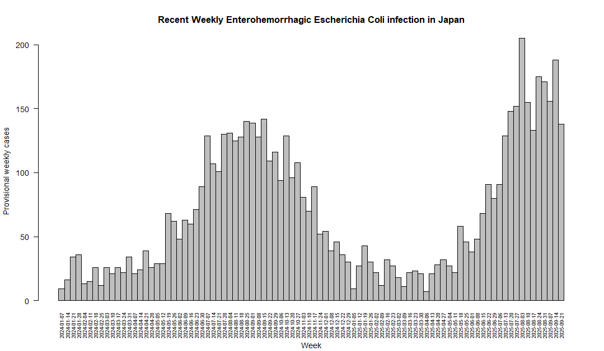

# jpinfect: Notifiable Infectious Diseases in Japan

<!-- badges: start -->

[](https://cran.r-project.org/package=jpinfect) [](https://joss.theoj.org/papers/4953ebf555b62a01098a78374465fa92) [](https://cran.r-project.org/package=jpinfect) [](https://cran.r-project.org/package=jpinfect)

<!-- badges: end -->

The `jpinfect` package provides tools for acquiring and processing notifiable infectious disease data in Japan. It is designed to help researchers, public health officials and developers access, clean, and manipulate data. This package aims to streamline data analysis processes while enabling reproducible research in public health and epidemiology.

Key features include:

-   Access ready-to-use datasets for immediate analysis.

-   Automate the downloading of raw data files for notifiable infectious disease, provided by the government

-   Tools for organising and renaming data files when importing into R

-   Combine segmented data files into a single dataset

-   Compatibility with epidemiological analysis and reporting workflows.

Data sourced from the Japan Institute for Health Security (JIHS). Data provided in this package is subject to their open data policy (Government Standard Terms of Use v1.0). For further details, see [data usage terms](https://id-info.jihs.go.jp/usage-contract.html). This library is independently developed and is not affiliated with any government entity.

## Installation

The `jpinfect` package can be installed from either CRAN or GitHub using the [remotes](https://github.com/r-lib/remotes/) package. Through the Github repository, the latest Provisional weekly Case Reports (bullet) data can be acquired, which may not be available on CRAN. To install the package, run the following command in your R console:

**From CRAN:**

``` r
install.packages("jpinfect")
```

**From GitHub (for the latest version):**

``` r
if(!require("remotes")) install.packages("remotes")
remotes::install_github("TomonoriHoshi/jpinfect")
```

Load the package after installation:

``` r
library(jpinfect)
```

## Usage

### Built-in Datasets

The following datasets are included in this package and sourced from the Japan Institute for Health Security (JIHS). These datasets are:

-   `sex_prefecture`: Confirmed weekly case reports on the sex distribution of reported cases by prefecture from 1999 to 2023. For further details, run `?sex_prefecture`.

-   `place_prefecture`: Confirmed weekly case reports about the place of infection by prefecture between 2001 and 2023. For further details, run `?place_prefecture`.

-   `bullet`: Provisional weekly case reported by prefecture from 2024 to the current latest reports. For further details, run `?bullet`.

``` r
# Loading build-in datasets
data("sex_prefecture")
data("place_prefecture")
data("bullet")
```

### Data Merging

The `jpinfect_merge` function helps to merge the datasets into one dataset if necessary, which enables users to start their data analysis instantly.

``` r
## Merge build-in datasets
# Merging confirmed case reports into one dataset
confirmed_dataset <- jpinfect_merge(sex_prefecture, place_prefecture)

# Merge three datasets
bind_result <- jpinfect_merge(sex_prefecture, place_prefecture, bullet)
```

### **Data Transformation from Wider to Longer; Vice Versa**

The `jpinfect_pivot` function enables users to seamlessly pivot datasets between wide and long formats. This functionality is particularly useful for reorganising data to suit analysis or visualisation needs.

``` r
# Pivot the dataset: wider to longer
bullet_long <- jpinfect_pivot(bullet)

# Pivot the dataset: longer to wider
bullet_wide <-  jpinfect_pivot(bullet_long)
```

The `jpinfect_pivot` function efficiently handles data transformation, ensuring compatibility with epidemiological workflows and making it easier to manage complex datasets.

## Building Datasets from Source

Although the build-in datasets are provided in this package, it is ideal for scientists, epidemiologists and public health officers to review whole data handling process from the upstream to downstream. For those who cares the precision of dataset, `jpinfect` provides the following functions to build the same datasets or even the latest bullet datasets sourced from the government-provided raw data.

### Data Source Checks

The sources of these datasets can be checked by using `jpinfect_url_confirmed` for confirmed case reports and `jpinfect_url_bullet` for provisional case reports, respectively.

``` r
## Check the source URL for confirmed dataset
# Download case reports by sex and prefecture
jpinfect_url_confirmed(year = 2021, type = "sex")

# Download case reports by the place of incetion and prefecture
jpinfect_url_confirmed(year = 2021, type = "place")
```

### Data Acquisition

The raw data can be downloaded using `jpinfect_get_confirmed` for confirmed case reports and `jpinfect_get_bullet` for provisional case reports, respectively. Confirmed weekly case data is organised into a single Microsoft Excel file for each year, while provisional data is provided as separate CSV files for each week. Since this function connect to the government website, it may take some time to download the data. To avoid excessive burden on the server, please kindly avoid downloading the files frequently. The downloaded files are saved under the specified directory (e.g., *raw_data* folder).

``` r
# Download data for 2020 and 2021
jpinfect_get_confirmed(years = c(2020, 2021), type = "sex", dest_dir = "raw_data")

# Download data for all available years
jpinfect_get_confirmed(type = "place", dest_dir = "raw_data")

# Download English data for weeks 1 to 5 in 2025
jpinfect_get_bullet(year = 2025, week = 1:5, dest_dir = "raw_data")

# Download Japanese data for all weeks in 2025
jpinfect_get_bullet(year = 2025, language = "jp", dest_dir = "raw_data")
```

### Data Import

The acquired raw data into your local computer could be imported into R using `jpinfect_read_confirmed` and `jpinfect_read_bullet`.

``` r
## Import confirmed case reports from file or directory
# Process a single file
dataset2021 <- jpinfect_read_confirmed(path = "2021_Syu_01_1.xlsx")

# Process all files in a directory
place_dataset <- jpinfect_read_confirmed(path = "raw_data", type = "place")


## Import bullet case reports
# Import all English reports in a directory
bullet <- jpinfect_read_bullet(directory = "raw_data")

# Import specific period of the data for 2025, weeks 1 to 10
bullet2025 <- jpinfect_read_bullet(year = 2025, week = 1:10, directory = "raw_data")
```

### Example Usage

The following example demonstrates how to use the `jpinfect` package to visualise the latest provisional weekly case reports in Japan. Specifically, it plots the provisional weekly number of *Enterohemorrhagic Escherichia coli infections*.

``` r
with(
    subset(bullet, prefecture == "Total"),
    barplot(
        `Enterohemorrhagic Escherichia coli infection (weekly)`, # Selected column name in bullet dataset
        names.arg = date,
        space = 0,
        xlab = c("\n", "\n", "\n", "Week"), # Add line breaks to move the x-axis label down
        ylab = "Provisional weekly cases",
        main = "Recent Weekly Enterohemorrhagic Escherichia Coli infection in Japan",
        las = 2
        )
)
```



## Community guidelines

If you encounter a bug or issue while using the `jpinfect` package, we encourage you to report it [here](https://github.com/TomonoriHoshi/jpinfect/issues). If you are happy to contribute the package, please see our [contributing guidelines](CONTRIBUTING.md).

We expect all contributors to adhere to the [Code of Conduct](CODE_OF_CONDUCT.md) to ensure a welcoming and inclusive environment for everyone.
