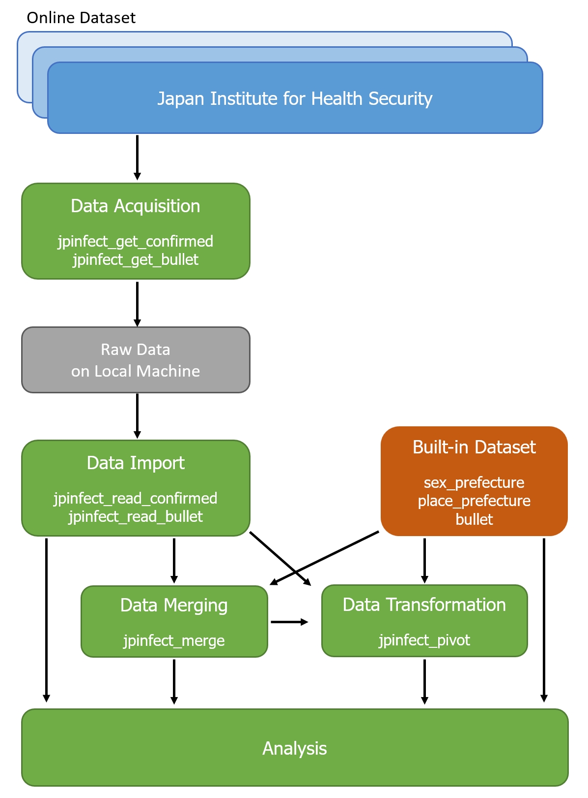

# Summary

`jpinfect` is an R [@Rdev:2025] package provides a set of functions to acquire and post-process notifiable infectious disease datasets from the Japan Institute for Health Security [@JIHS]. The package facilitates to generate combined datasets of weekly case reports since week 14th 1999 by prefecture, where available, sex and suspected location of infection information. In addition to its core functionalities, the package also includes built-in datasets that have already been pre-processed using the provided functions. These datasets are ready for immediate analysis, making it easier for researchers, public health practitioners and educators to utilise officially released public data. The package is designed to streamline epidemiological research, enhance public health response and support educational efforts. Ultimately, `jpinfect` aims to assist researchers and practitioners in responding to notifiable infectious diseases in Japan efficiently. All package code is archived on [GitHub](https://github.com/TomonoriHoshi/jpinfect), allowing users to extend its functionality and adapt it to their specific needs.

# Statement of need

The global pandemic of COVID-19 highlighted the importance of reliable epidemiological dataset for outbreak monitoring and effective disease control [@Dehkordi:2020]. Thanks to computer advancements, mathematical modelling methods based on the large dataset could be implemented in many countries for the COVID-19 response [@Vynnycky:2011; @Ferguson:2020]. This experience emphasised that timely and accurate information is one of the most important keys for successful disease control [@Gulland:2020]. Indeed, public health officers and epidemiologists worked for governmental organisations paid their greatest attention about whether any epidemiological suggestions were based on the reliable data sources [@WHO:2020].

In real-world settings, officially released datasets from government organisations, while comprehensive, are the most reliable source. However, these are often difficult to process for immediate use due to their complex structure [@Vetrò:2016]. This barrier hindered rapid response for containing the outbreak [@Stoto:2022]. The ability to prepare, clean, and standardise these datasets during non-emergency periods is essential for improving responsiveness in the event of future outbreaks.

The `jpinfect` package was specifically designed to address these challenges by providing a streamlined workflow for acquiring and processing notifiable infectious disease datasets from the Japan Institute for Health Security [@JIHS]. By automating data retrieval, standardisation, and integration into analysable formats, the package reduces barriers for researchers, public health practitioners, and educators, enabling them to focus on actionable insights.

# Statement of the field

Epidemiological research and infectious disease modelling have become increasingly critical tools for public health interventions and policy-making [@Ferguson:2020]. The COVID-19 pandemic demonstrated the global dependency on accurate and timely epidemiological data for forecasting infection trends, evaluating interventions, and informing public health strategies.

In Japan, the government has national infectious disease monitoring network since week 14 of 1999. While Japanese government provides a comprehensive repository of such datasets, the raw data were allocated in different webpages because of reorganisation of the ministry of health in the past decades. Therefore, acquiring the appropriate datasets from the websites could be a challenge, especially in settings where time matters [@Guo:2023]. Moreover, the raw data typically distributed in formats, requiring significant preprocessing before analysis. This complexity limits accessibility, particularly for researchers who lack the resources to perform extensive data cleaning.

The `jpinfect` package fills a critical gap in the field by offering tools to automate and simplify the preparation of these datasets. By standardising data formats, merging disparate sources, and enabling seamless integration into analytical workflows, `jpinfect` supports the needs of epidemiologists, data scientists, and public health officials who rely on robust data for disease surveillance, intervention planning, and teaching.

# **Pipeline Overview**

The `jpinfect` package provides an efficient and streamlined pipeline for acquiring and processing infectious disease datasets from the Japan Institute for Health Security. The pipeline consists of the following steps:

1.  **Data Acquisition**: Raw data can be acquired using the following functions:

    -   `jpinfect_get_confirmed`: Downloads confirmed case reports by year and data type (e.g., sex or place of infection).

    -   `jpinfect_get_bullet`: Downloads weekly provisional case reports.

    The downloaded data is stored locally and organised for further processing.

2.  **Data Import**: The acquired data can be read into R using:

    -   `jpinfect_read_confirmed`: Imports confirmed case reports from local files or directories.

    -   `jpinfect_read_bullet`: Imports provisional weekly reports from local directories.

3.  **Built-in Datasets**: For immediate analysis, the package provides pre-processed datasets:

    -   `sex_prefecture`: Weekly confirmed cases by sex and prefecture.

    -   `place_prefecture`: Weekly confirmed cases by place of infection and prefecture.

    -   `bullet`: Provisional weekly case reports.

4.  **Data Merging**: The imported or built-in datasets can be merged using:

    -   `jpinfect_merge`: Combines multiple datasets into a single dataset for comprehensive analysis.

5.  **Data Transformation**: The merged data can be converted between wide and long formats using:

    -   `jpinfect_pivot`: Enables users to adjust the data format to suit specific analytical workflows.

6.  **Analysis**: The processed data is ready for various epidemiological analyses, such as outbreak monitoring, modelling and reporting.

During package development, we used GitHub Copilot within RStudio to assist with coding, and Microsoft Copilot to support both coding and debugging. 

# Acknowledgements

We acknowledge the Japan Institute for Health Security to distribute public data. Without their dedicated efforts to maintain the dataset available and updates, this package could not be developed.

# References
