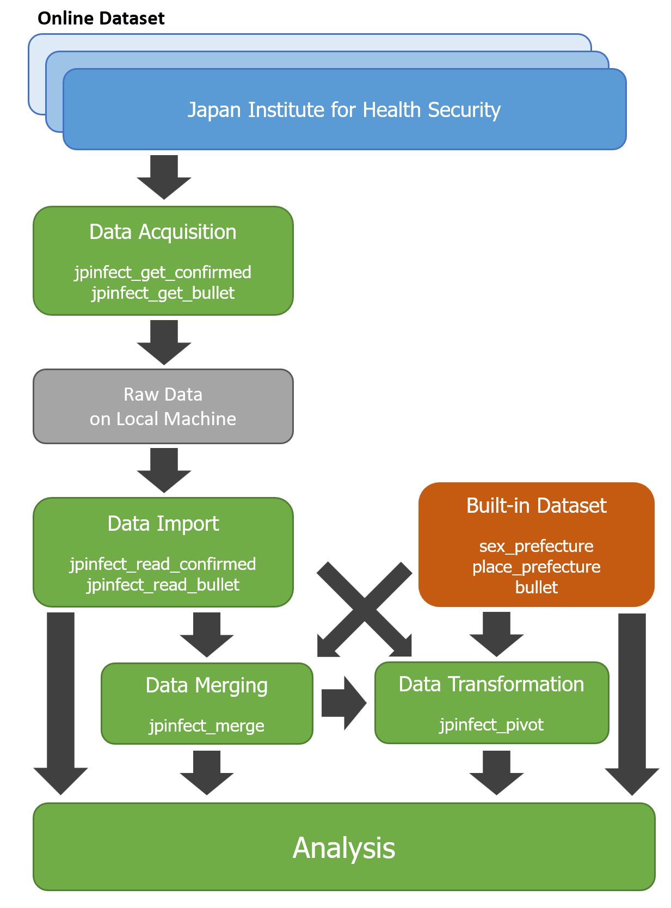

# Summary

`jpinfect` is an R [@Rdev:2025] package that provides a set of functions to acquire and process notifiable infectious disease datasets from the Japan Institute for Health Security [@JIHS]. The package helps generate combined datasets of weekly case reports since week 14 of 1999 by prefecture and, where available, sex and suspected location of infection information. In addition to its core functionalities, the package also includes pre-processed built-in datasets. These datasets are ready for immediate analysis, making it easier to utilise officially released public data. The package is designed to streamline epidemiological research, enhance public health response and support educational efforts. Ultimately, `jpinfect` aims to assist researchers and practitioners in responding efficiently to notifiable infectious diseases in Japan. All code is archived on [GitHub](https://github.com/TomonoriHoshi/jpinfect) for extension and adaptation.

# Statement of need

The COVID-19 pandemic highlighted the importance of reliable epidemiological dataset for outbreak monitoring and effective disease control [@Dehkordi:2020]. Thanks to computer advancements, mathematical modelling methods based on the large dataset could be implemented in many countries for the COVID-19 response [@Vynnycky:2011; @Ferguson:2020]. This experience emphasised that timely and accurate information is crucial for successful disease control [@Gulland:2020]. Consequently, public health officers and epidemiologists at government organisations paid particular attention to ensuring that all epidemiological recommendations were grounded in reliable data sources [@WHO:2020].

In real-world settings, officially released datasets from government organisations, while comprehensive, are the most reliable source. However, these are often difficult to process for immediate use due to their complex structure [@Vetrò:2016]. This barrier hindered rapid response for containing the outbreak [@Stoto:2022]. Preparing, cleaning and standardising these datasets during non-emergency periods is essential for improving responsiveness in the event of future outbreaks.

The `jpinfect` package was specifically designed to address these challenges by providing a streamlined workflow for acquiring and processing notifiable infectious disease datasets from the Japan Institute for Health Security [@JIHS]. By automating data retrieval, standardisation, and integration into analysable formats, the package reduces barriers for researchers, public health practitioners and educators, enabling them to focus on actionable insights.

# Statement of the field

Epidemiological research and infectious disease modelling have become increasingly critical tools for public health interventions and policy-making [@Ferguson:2020]. The COVID-19 pandemic demonstrated the global dependency on accurate and timely epidemiological data for forecasting infection trends, evaluating interventions and informing public health strategies. R packages such as epidm and ukbtools prepare health data in the UK [@epidm; @Hanscombe:2019], while in the United States, epidatr, cdcfluview and covidcast streamline retrieval of epidemiological surveillance datasets via APIs [@epidatr; @cdcfluview; @covidcast].

In Japan, the government has maintained a national infectious disease monitoring network since week 14 of 1999. However, the raw data are scattered across multiple webpages due to Ministry reorganisations over the past decades. As a result, acquiring the appropriate datasets can be challenging, especially in time-sensitive settings [@Guo:2023]. No software currently exists to facilitate the raw data acquisition, and the data are often in inconsistent formats, requiring significant preprocessing before analysis. This complexity hinders users' productivity. Notably, these websites lack full English translation and a user-friendly format for non-Japanese speakers. Retrieving and preparing these datasets manually is labour‑intensive. It requires downloading and merging 52–53 weekly Excel sheets for each year from 1999 to 2023 for confirmed case data and individual weekly CSV files for provisional reports. These files are scattered across multiple webpages in varying formats, requiring extensive manual preprocessing.

The `jpinfect` package fills a critical gap in the field by offering tools to automate and simplify the preparation of these datasets. By standardising formats, merging sources, and providing built-in datasets, `jpinfect` supports researchers, public health practitioners and educators.

# **Pipeline Overview**

The `jpinfect` package provides an efficient and streamlined pipeline for acquiring and processing infectious disease datasets from the Japan Institute for Health Security. The pipeline consists of the following steps:

1.  **Data Acquisition**: Raw data can be acquired using the following functions:

    -   `jpinfect_get_confirmed`: Downloads confirmed case reports by year and data type (e.g., sex or place of infection).

    -   `jpinfect_get_bullet`: Downloads weekly provisional case reports.

    The downloaded data is stored locally and organised for further processing.

2.  **Data Import**: The acquired data can be read into R using:

    -   `jpinfect_read_confirmed`: Imports confirmed case reports from local files or directories.

    -   `jpinfect_read_bullet`: Imports provisional weekly reports from local directories.

3.  **Built-in Datasets**: For immediate analysis, the package provides pre-processed datasets:

    -   `sex_prefecture`: Weekly confirmed cases by sex and prefecture.

    -   `place_prefecture`: Weekly confirmed cases by place of infection and prefecture.

    -   `bullet`: Provisional weekly case reports.

4.  **Data Merging**: The imported or built-in datasets can be merged using:

    -   `jpinfect_merge`: Combines multiple datasets into a single dataset for comprehensive analysis.

5.  **Data Transformation**: The merged data can be converted between wide and long formats using:

    -   `jpinfect_pivot`: Enables users to adjust the data format to suit specific analytical workflows.

6.  **Analysis**: The processed data is ready for various epidemiological analyses, such as outbreak monitoring, modelling and reporting.

During package development, we used GitHub Copilot within RStudio to assist with coding and Microsoft Copilot to support both coding and debugging.

# Acknowledgements

We thank the Japan Institute for Health Security for providing public data.

# References
